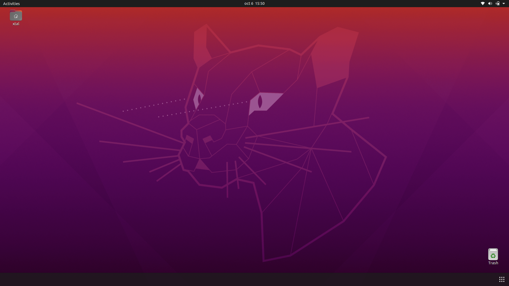

# ROS-Mobile-Robot

Mobile Robot using ROS and ESP32 (rosserial).

## Table of Contents
- [ROS-Mobile-Robot](#ros-mobile-robot)
  - [Table of Contents](#table-of-contents)
  - [Hardware Requirements](#hardware-requirements)
  - [Software Requirements](#software-requirements)
  - [Installation](#installation)
  - [Usage](#usage)
  - [License](#license)

## Hardware Requirements
- ESP32.
- Motors.
- L298N.
- 18650 batteries.

## Software Requirements
In order for the project to work we need to have installed [Ubuntu 20.04 LTS Focal Fossa](https://releases.ubuntu.com/focal/) alocated
in a partition with a Windows dual boot or as the main Operating System of your machine. 



You can try to virtualize it but in my experience, networking and driver problems arouse.

## Installation
We need to install [ROS Noetic Ninjemys](https://wiki.ros.org/noetic), you can follow the [documentation](https://wiki.ros.org/noetic/Installation/Ubuntu) on how to install it or you can follow and run these few commands inside Ubuntu's terminal:

```shell
sudo sh -c 'echo "deb http://packages.ros.org/ros/ubuntu $(lsb_release -sc) main" > /etc/apt/sources.list.d/ros-latest.list'
```

```shell
sudo apt install curl
curl -s https://raw.githubusercontent.com/ros/rosdistro/master/ros.asc | sudo apt-key add -
```

```shell
sudo apt update
sudo apt install ros-noetic-desktop-full
echo "source /opt/ros/noetic/setup.bash" >> ~/.bashrc
source ~/.bashrc
```

## Usage
After uploading the code to your ESP32 microcontroller you need to initialize the services.

We initialize our master:
```shell
roscore
```

To initialize our serial node using tcp protocol:
```shell
rosrun rosserial_python serial_node.py tcp
```

To initialize our joy node using joy package:
```shell
rosrun joy joy_node
```

If we want to see our joy node response:
```shell
rostopic echo joy
```

## License
[Under MIT License](https://opensource.org/osd).